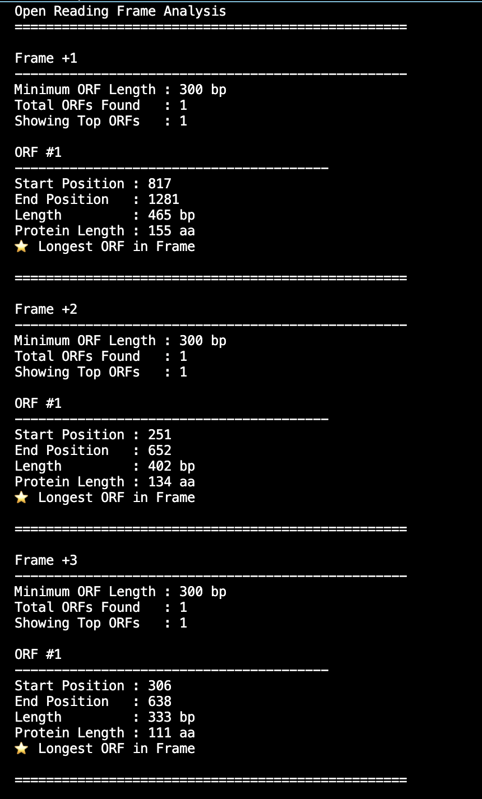

# FASTA Sequence Analyzer


A comprehensive command-line bioinformatics toolkit for analyzing DNA sequences from FASTA files. This project provides sequence validation, nucleotide statistics, transcription, translation, motif searching, restriction enzyme analysis, and multi-frame Open Reading Frame (ORF) detection.

---

## Features

- Read and parse FASTA files
- Validate DNA sequences
- Calculate GC content
- Count nucleotide composition (A, T, G, C, N)
- Generate reverse complement sequences
- DNA → RNA transcription
- DNA → Protein translation
- DNA motif searching
- Restriction enzyme recognition site analysis
- Open Reading Frame (ORF) analysis
- Three forward reading frame analysis (+1, +2, +3)
- Minimum ORF length filtering
- Display Top-N longest ORFs
- Export analysis reports

---

## Project Structure

```
FASTA-Sequence-Analyzer
│
├── fasta_analyzer.py          # Main CLI application
├── sequence_utils.py          # Bioinformatics utility functions
├── requirements.txt
├── README.md
├── LICENSE
│
├── sample_data/
│   └── human_gene.fasta
│
├── screenshots/
│
└── output/
```

---

## Installation

Clone the repository

```bash
git clone https://github.com/HareemAhmad-Molbio/FASTA-Sequence-Analyzer.git
```

Move into the project

```bash
cd FASTA-Sequence-Analyzer
```

Create a virtual environment

### macOS / Linux

```bash
python3 -m venv venv
source venv/bin/activate
```

### Windows

```bash
python -m venv venv
venv\Scripts\activate
```

Install dependencies

```bash
pip install -r requirements.txt
```

---

## Usage

Basic sequence analysis

```bash
python fasta_analyzer.py sample_data/human_gene.fasta
```

Export report

```bash
python fasta_analyzer.py sample_data/human_gene.fasta \
--output output/report.txt
```

---

## Motif Search

Search for a DNA motif

```bash
python fasta_analyzer.py sample_data/human_gene.fasta \
--find ATG
```

---

## Restriction Enzyme Analysis

Example

```bash
python fasta_analyzer.py sample_data/human_gene.fasta \
--enzyme EcoRI
```

Supported enzymes include:

- EcoRI
- BamHI
- HindIII
- NotI
- XhoI

---

## Open Reading Frame (ORF) Analysis

Analyze ORFs in a single reading frame

```bash
python fasta_analyzer.py sample_data/human_gene.fasta \
--orf \
--frame 1
```

Analyze all three forward reading frames

```bash
python fasta_analyzer.py sample_data/human_gene.fasta \
--orf \
--frame all \
--min-length 300 \
--top 3
```

Example Output

```
Frame +1
Longest ORF : 465 bp

Frame +2
Longest ORF : 402 bp

Frame +3
Longest ORF : 333 bp
```

---

## Command Line Options

| Option | Description |
|---------|-------------|
| input | FASTA file |
| --output | Save report to file |
| --find | Search DNA motif |
| --enzyme | Restriction enzyme analysis |
| --orf | Perform ORF analysis |
| --frame | Reading frame (1, 2, 3, all) |
| --min-length | Minimum ORF length |
| --top | Display top N ORFs |

---

## Example Workflow

```bash
python fasta_analyzer.py sample_data/human_gene.fasta \
--orf \
--frame all \
--min-length 300 \
--top 5 \
--output output/orf_report.txt
```

---

## Screenshots

### Sequence Analysis


---

### Motif Search


---

### Restriction Enzyme Analysis


---

### Three Reading Frame ORF Analysis



---

## Technologies Used

- Python 3
- Biopython
- argparse
- pathlib

---

## Future Improvements

- Six-frame ORF analysis
- Codon usage statistics
- GC content sliding window analysis
- Restriction enzyme maps
- ORF visualization
- Protein FASTA support
- GenBank file support
- Interactive HTML reports

---

## License

This project is released under the MIT License.

---

## About the Author

**Hareem Ahmad**

M.Sc. Molecular Biology & Biochemistry

I am a molecular biologist. My interests include sequence analysis, genomics, CRISPR technologies, Python programming, and developing open-source bioinformatics software.

This repository is part of my Bioinformatics Portfolio, where I build practical tools and algorithms for biological data analysis.

- 🧬 Molecular Biology
- 🧪 Bioinformatics
- 💻 Python Programming
- 🧠 Computational Biology
- 🔬 Genomics
- 🧫 CRISPR Diagnostics

**GitHub**

https://github.com/HareemAhmad-Molbio

**LinkedIn**

https://www.linkedin.com/in/hareemahmad12/