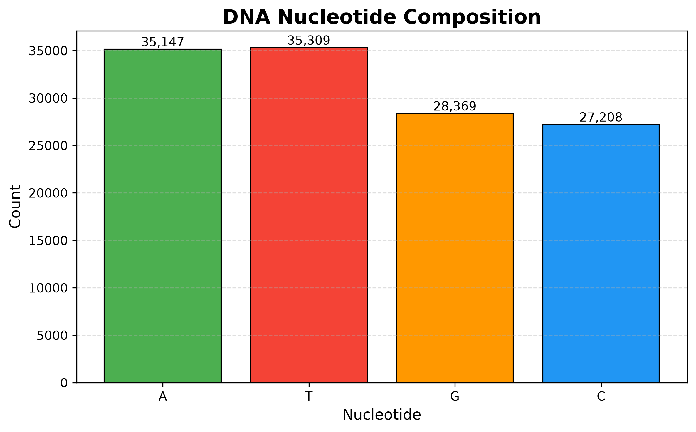
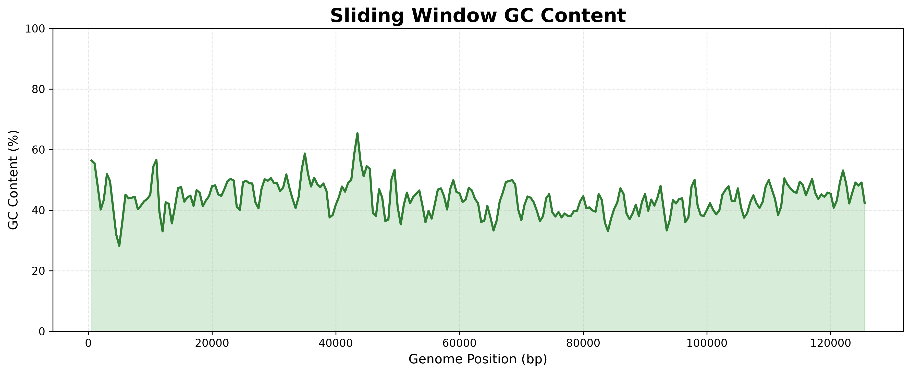
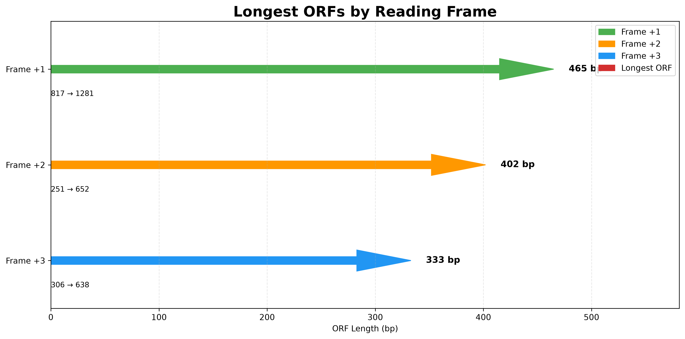
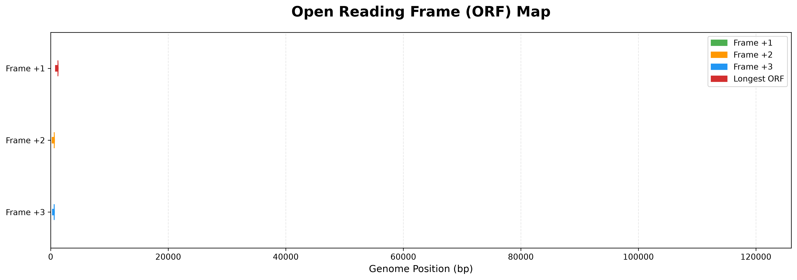
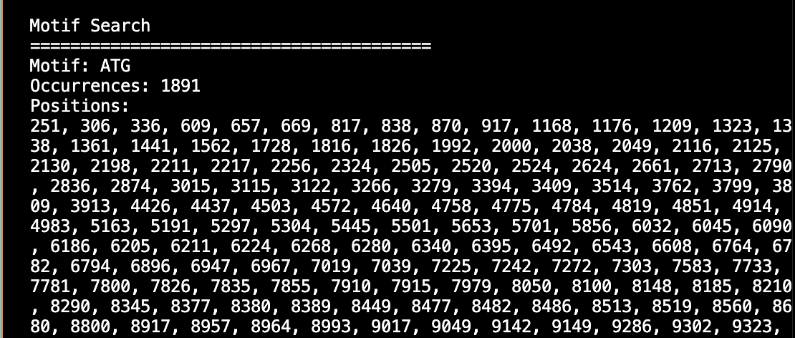
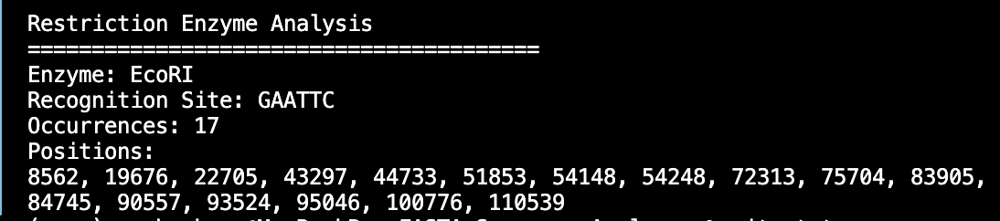
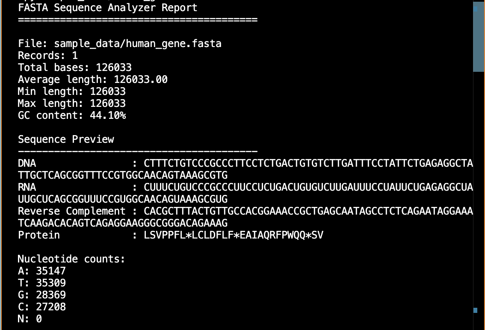

# 🧬 FASTA Sequence Analyzer

A Python-based bioinformatics toolkit for analyzing DNA FASTA sequences. This project provides sequence statistics, motif searching, restriction enzyme analysis, multi-frame Open Reading Frame (ORF) detection, and publication-quality genomic visualizations.


---

# 📖 Overview

FASTA Sequence Analyzer is a command-line bioinformatics application developed in Python for DNA sequence analysis. It combines commonly used molecular biology analyses with publication-quality visualizations, making it suitable for students, researchers, and anyone learning bioinformatics.

The toolkit currently supports:

- FASTA sequence parsing
- Sequence validation
- Nucleotide composition analysis
- GC content calculation
- DNA → RNA transcription
- Protein translation
- Reverse complement generation
- DNA motif searching
- Restriction enzyme recognition site analysis
- Three-frame Open Reading Frame (ORF) detection
- Scientific visualizations

---

# ✨ Features

## 🧬 Sequence Analysis

- FASTA file parsing
- Sequence validation
- Nucleotide composition
- GC content calculation
- DNA → RNA transcription
- Reverse complement generation
- Protein translation

---

## 🔬 Biological Analysis

- DNA motif search
- Restriction enzyme recognition site detection
- Three-frame ORF detection
- Configurable minimum ORF length
- Longest ORF identification
- Multi-frame ORF comparison

---

## 📊 Scientific Visualizations

- DNA nucleotide composition chart
- Sliding-window GC content analysis
- Genome-wide ORF overview
- Longest ORF comparison between reading frames

---

# 📂 Project Structure

```text
FASTA-Sequence-Analyzer/
│
├── fasta_analyzer.py          # Main CLI application
├── sequence_utils.py          # Sequence analysis functions
├── visualization.py           # Plotting and visualization
├── requirements.txt
├── README.md
├── LICENSE
│
├── sample_data/
│   └── human_gene.fasta
│
├── output/
│   ├── nucleotide_counts.png
│   ├── gc_content.png
│   ├── orf_overview.png
│   └── orf_comparison.png
│
└── screenshots/
```

---

# ⚙️ Installation

Clone the repository:

```bash
git clone https://github.com/HareemAhmad-Molbio/FASTA-Sequence-Analyzer.git

cd FASTA-Sequence-Analyzer
```

Create a virtual environment:

```bash
python3 -m venv venv
```

Activate the environment

### macOS / Linux

```bash
source venv/bin/activate
```

### Windows

```bash
venv\Scripts\activate
```

Install dependencies

```bash
pip install -r requirements.txt
```

---

# 🚀 Usage

## Basic Analysis

```bash
python fasta_analyzer.py sample_data/human_gene.fasta
```

---

## Search DNA Motif

```bash
python fasta_analyzer.py sample_data/human_gene.fasta --find ATG
```

---

## Restriction Enzyme Analysis

```bash
python fasta_analyzer.py sample_data/human_gene.fasta --enzyme EcoRI
```

---

## Open Reading Frame Analysis

Single frame

```bash
python fasta_analyzer.py sample_data/human_gene.fasta --orf
```

All three reading frames

```bash
python fasta_analyzer.py sample_data/human_gene.fasta --orf --frame all
```

Specify minimum ORF length

```bash
python fasta_analyzer.py sample_data/human_gene.fasta --orf --frame all --min-length 300
```

---

## Generate Visualizations

```bash
python fasta_analyzer.py sample_data/human_gene.fasta --plot
```

Generate plots together with ORF analysis

```bash
python fasta_analyzer.py sample_data/human_gene.fasta --plot --orf --frame all
```

---

# 🖥 Command-Line Options

| Option | Description |
|---------|-------------|
| `--find` | Search for a DNA motif |
| `--enzyme` | Search restriction enzyme recognition sites |
| `--orf` | Perform ORF analysis |
| `--frame` | Select reading frame (1, 2, 3 or all) |
| `--min-length` | Minimum ORF length |
| `--top` | Number of ORFs displayed |
| `--plot` | Generate visualization figures |
| `--output` | Save report to a text file |

---

# 📈 Example Visualizations

## 🧬 DNA Nucleotide Composition

Displays the nucleotide frequency (A, T, G, and C) of the analyzed DNA sequence.



---

## 📈 Sliding Window GC Content

Visualizes GC percentage variation across the genome using a sliding window approach.



---

## 🧬 ORF Comparison

Compares the longest Open Reading Frames identified in each reading frame.



---

## 🗺️ Genome-wide ORF Overview

Shows the genomic locations of detected Open Reading Frames across reading frames.



---

## 🔎 Motif Search Example

Example output showing DNA motif detection and matching positions.



---

## ✂️ Restriction Enzyme Analysis

Example showing restriction enzyme recognition site detection.



---

## 💻 Command-Line Output

Example execution of the FASTA Sequence Analyzer from the terminal.



# 🧪 Technologies Used

- Python 3
- Biopython
- Matplotlib
- argparse
- pathlib

---

# 🎯 Future Improvements

Planned features for future releases include:

- Modular package architecture
- HTML report generation
- CSV export
- Protein property analysis
- Sequence alignment tools
- Restriction enzyme visualization
- Interactive plots
- Automated unit testing
- Continuous Integration (GitHub Actions)

---

# 🤝 Contributing

Contributions, suggestions, and feature requests are welcome.

If you would like to improve this project:

1. Fork the repository
2. Create a feature branch
3. Commit your changes
4. Open a Pull Request

---

# 📜 License

This project is licensed under the MIT License.

---

## About the Author

**Hareem Ahmad**

M.Sc. Molecular Biology & Biochemistry

I am a molecular biologist. My interests include sequence analysis, genomics, CRISPR technologies, Python programming, and developing open-source bioinformatics software.

This repository is part of my Bioinformatics Portfolio, where I build practical tools and algorithms for biological data analysis.

- 🧬 Molecular Biology
- 🧪 Bioinformatics
- 💻 Python Programming
- 🧠 Computational Biology
- 🔬 Genomics
- 🧫 CRISPR Diagnostics

**GitHub**

https://github.com/HareemAhmad-Molbio

**LinkedIn**

https://www.linkedin.com/in/hareemahmad12/